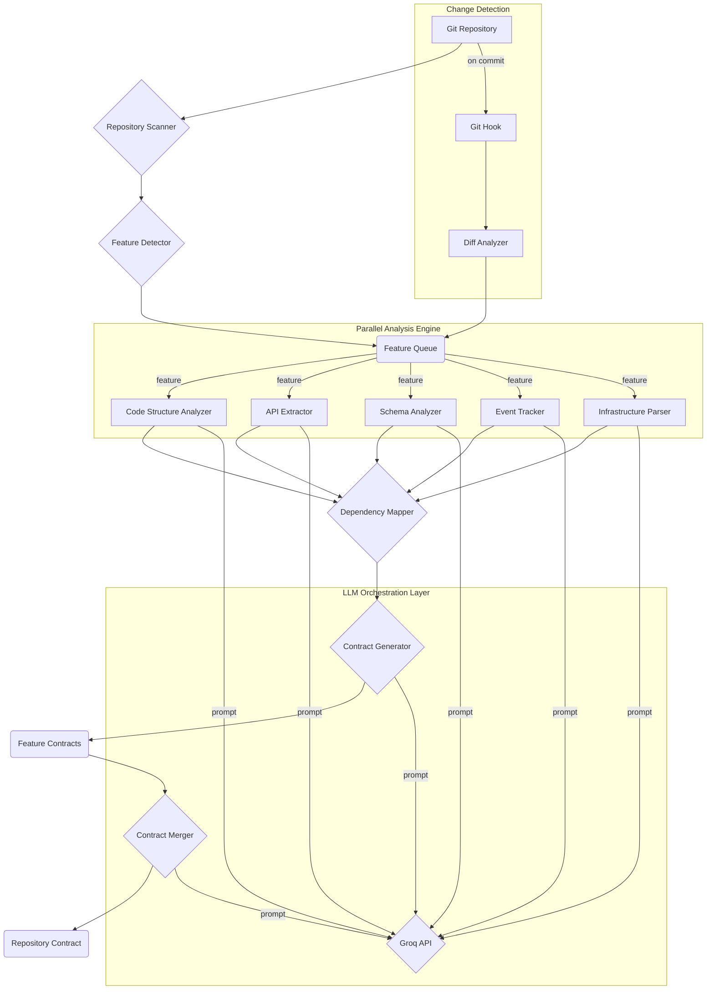

> # Technical Specification: DevOps Agent
> 
> **Author**: Manus AI
> 
> **Version**: 1.0
> 
> **Date**: 2026-01-15

## 1. Introduction

This document provides a detailed technical specification for the DevOps Agent. It builds upon the concepts outlined in the Product Requirements Document (PRD) and the System Architecture Design, providing a blueprint for implementation.

### 1.1. Purpose

The purpose of this specification is to guide the development of the DevOps Agent, ensuring that all components are built to a common standard and integrate seamlessly. It details the system's architecture, data models, workflows, and integration points.

## 2. System Architecture

The system architecture is composed of several key components that work in concert to analyze a repository and maintain its contracts. The high-level architecture is described in the `system_architecture_design.md` document. This section will provide a more detailed breakdown.

### 2.1. Architectural Diagram



### 2.2. Component Breakdown

*   **Repository Scanner**: A Python script that uses `gitpython` to clone repositories and `os.walk` to traverse the file system.
*   **Feature Detector**: A rule-based engine combined with an LLM classifier. It uses heuristics (e.g., `pom.xml`, `package.json`, directory name) and an LLM prompt to classify directories as features, shared libraries, or infrastructure.
*   **Analysis Engine**: A multi-process or multi-threaded Python application that consumes features from a queue and assigns them to available analyzer workers.
*   **Analyzers**: Each analyzer is a Python class with a standard `analyze(feature_path)` method. They use a combination of static analysis libraries (e.g., `ast` for Python, `tree-sitter` for others) and targeted LLM prompts.
*   **Contract Generator**: A templating engine (e.g., Jinja2) that populates predefined contract structures with the output from the analyzers.
*   **Contract Merger**: An LLM-driven component that takes multiple feature contracts as input and uses a specific prompt to merge them, resolving conflicts based on predefined rules.
*   **LLM Orchestrator**: A Python module that manages all interactions with the Groq API, handling model selection, prompt formatting, retries, and error handling.

## 3. Data Models and Schemas

This section defines the structure of the contract files that will be generated and stored in the repository.

### 3.1. `feature_contract.json`

```json
{
  "featureName": "string",
  "description": "string",
  "path": "string",
  "language": "string",
  "frameworks": ["string"],
  "dependencies": {
    "internal": ["string"], // Other features
    "external": ["string"]  // Third-party libraries
  },
  "contracts": {
    "api": "path/to/api_contract.yaml",
    "schema": "path/to/schema_contract.sql",
    "events": "path/to/events_contract.json",
    "infrastructure": "path/to/infra_contract.json"
  }
}
```

### 3.2. `api_contract.yaml` (OpenAPI 3.0)

Standard OpenAPI 3.0 specification format. The agent will extract paths, methods, parameters, request bodies, and responses from the source code.

### 3.3. `schema_contract.sql`

A SQL file containing `CREATE TABLE` statements for all database tables associated with the feature.

### 3.4. `events_contract.json`

```json
{
  "produces": [
    {
      "eventName": "string",
      "topic": "string",
      "schema": {}
    }
  ],
  "consumes": [
    {
      "eventName": "string",
      "topic": "string",
      "handler": "string" // Function/method that handles the event
    }
  ]
}
```

### 3.5. `repo_contract.json`

A merged and consolidated view of all `feature_contract.json` files, providing a complete overview of the repository.

## 4. LLM Integration and Prompting

The core intelligence of the agent comes from its interaction with LLMs. The `system_architecture_design.md` provides a detailed list of prompt sequences. The implementation will involve a `PromptManager` class responsible for:

*   Loading prompt templates from a configuration file.
*   Injecting context (repository name, file content, etc.) into the templates.
*   Selecting the appropriate model for each prompt based on the orchestration strategy.
*   Executing the API call to Groq and parsing the response.

**Example Prompt Execution Flow (API Extraction):**

1.  `PromptManager.get_prompt("api_extraction", context)`
2.  Context includes file content, language, and known frameworks.
3.  The prompt template instructs the LLM to act as a senior developer and identify API endpoints.
4.  `LLMOrchestrator.execute("qwen-2.5-32b", formatted_prompt)`
5.  The orchestrator makes the API call, handles potential errors (e.g., rate limits), and returns the raw JSON output.
6.  The API Extractor parses the JSON and validates it against the expected schema.

## 5. Workflow and Process Flow

### 5.1. Initial Repository Scan

1.  Clone the target repository.
2.  Execute the `RepositoryScanner` to list all files.
3.  Run the `FeatureDetector` to identify feature directories.
4.  Populate a queue with the list of features to be analyzed.
5.  Launch the parallel analysis engine.
6.  For each feature, workers pick it from the queue and execute the full analysis pipeline (all analyzers).
7.  As analyzers complete, the `ContractGenerator` creates the feature-specific contract files.
8.  Once all features are analyzed, the `ContractMerger` is triggered to create the main `repo_contract.json`.
9.  All generated/updated contract files are committed to the repository.

### 5.2. Incremental Update (via Git Hook)

1.  The `pre-commit` hook is triggered.
2.  The hook executes a script that runs `git diff --name-only --cached` to get a list of staged files.
3.  For each changed file, the system identifies the feature it belongs to.
4.  The affected feature is added to the analysis queue.
5.  The dependency graph is used to identify any downstream features that might be impacted.
6.  Impacted features are also added to the queue.
7.  The analysis engine runs only on the features in the queue.
8.  The relevant feature contracts and the main repository contract are updated.
9.  The updated contract files are added to the commit (`git add`).

## 6. Error Handling and Logging

*   **Logging**: The system will use Python's standard `logging` module. Log levels will be configurable. All LLM prompts and their raw responses will be logged at the `DEBUG` level for traceability.
*   **Retries**: The `LLMOrchestrator` will implement an exponential backoff retry mechanism for transient API errors.
*   **Validation**: All LLM outputs will be validated against a Pydantic model. If validation fails, the prompt will be retried up to 3 times with a modified instruction asking for corrected formatting.
*   **Fallbacks**: If a primary model fails consistently, the orchestrator will automatically switch to the designated fallback model.

## 7. Security

*   **Credential Scrubbing**: Before any file content is sent to an LLM, it will be scanned for common secret patterns (API keys, passwords) using a library like `detect-secrets`. Any findings will be replaced with a placeholder (e.g., `[SCRUBBED_SECRET]`).
*   **API Key Management**: The Groq API key will be managed via environment variables and will not be hardcoded.
*   **Sandboxing**: The analysis will run in a sandboxed environment (e.g., a Docker container) to prevent any unintended side effects on the host system.

## 8. Testing Strategy

*   **Unit Tests**: Each analyzer and utility class will have comprehensive unit tests.
*   **Integration Tests**: A suite of tests will run against a sample repository, verifying the end-to-end workflow from scanning to contract generation.
*   **LLM Evals**: A separate evaluation suite will test the quality and accuracy of different prompts and models against a golden dataset of code snippets and expected outputs.
*   **Regression Tests**: The integration tests will serve as regression tests, ensuring that new changes do not break existing functionality.

## 9. Deployment and Integration

The primary deployment method is as a `pre-commit` hook.

**`.pre-commit-config.yaml`:**

```yaml
repos:
  - repo: local
    hooks:
      - id: devops-agent
        name: DevOps Agent Repository Analysis
        entry: devops-agent-run --incremental
        language: system
        types: [python, go, javascript]
        pass_filenames: false
```

The agent will also be packaged as a CLI tool that can be run manually for initial setup or full re-analysis.

**CLI Commands:**

*   `devops-agent-run --full`: Perform a full analysis of the repository.
*   `devops-agent-run --incremental`: Analyze only the files changed in the current Git stage.
*   `devops-agent-configure`: Interactively configure the agent for a new repository.
